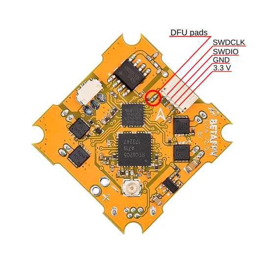
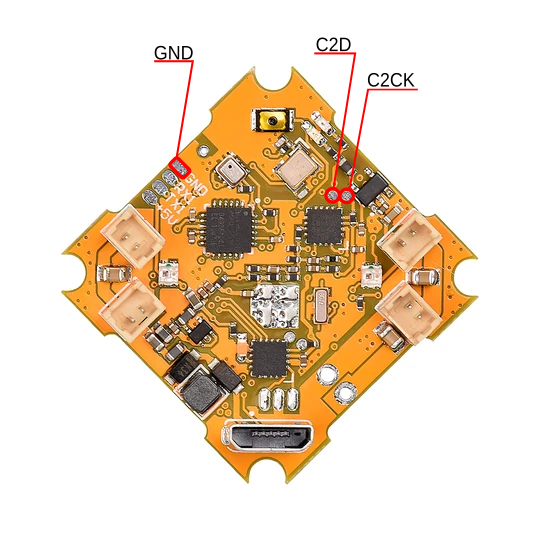
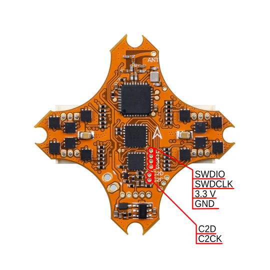
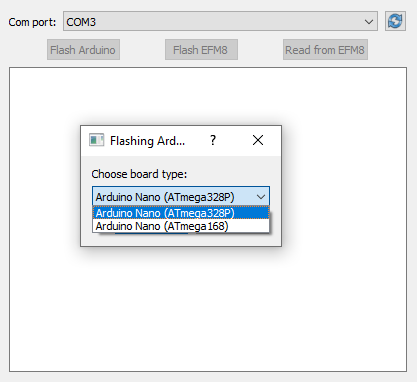
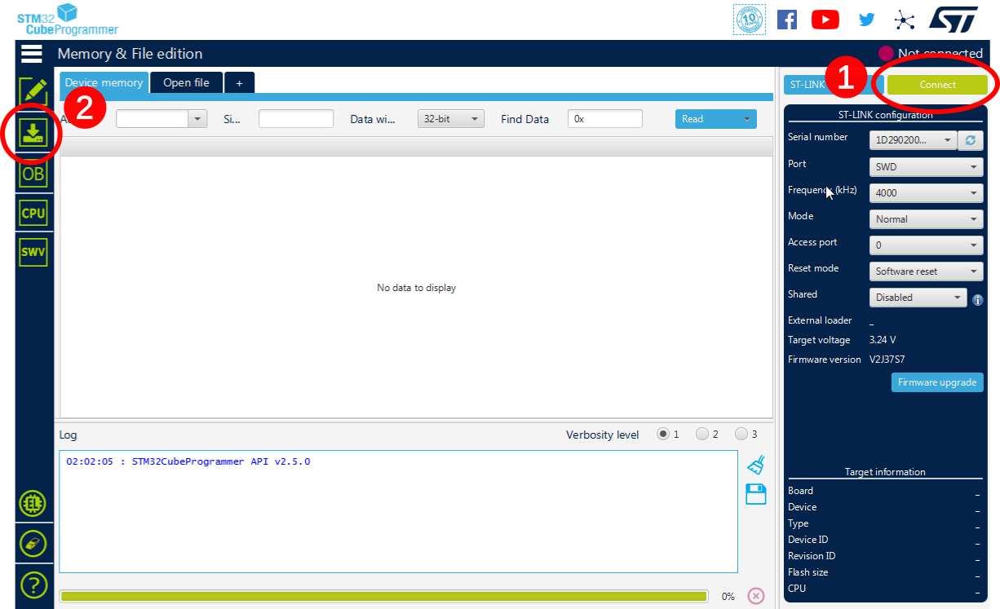
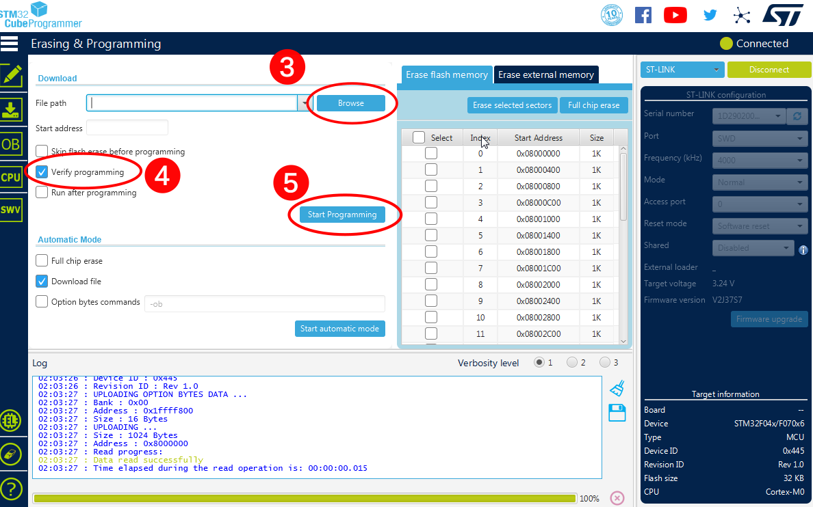
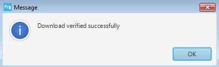
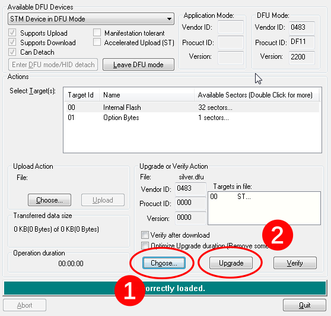
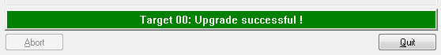

# LiteSilverware+
LiteSilverware+ consists of two parts - LiteSilverware itself and LiteOSD. Both components will be flashed separately with their own flashing tools.

## FC pinout
### Lite Brushed


### Lite Brushless 1s


## Flashing OSD 
You will need: 
- Arduino Nano (other Arduino boards are fine too, but requires some additional steps)
- some AWG 30 wires, pins and dupont wires (last two are optional - wires can be soldered directly to Arduino without connectors)
- soldering iron with thin tip 
First you need to make some soldering - Arduino's GND to FC ground, D2 pin to C2D and D3 to C2CK (see pictures in pinout section). Then download flasher here - [EFM8 Arduino Programmer](https://github.com/jumper047/efm8-arduino-programmer/releases). If you are using Linux it will be easier to install it via python package manager, just open your terminal and type `python -m pip install git+https://github.com/jumper047/efm8-arduino-programmer.git` and run it with command `efm8_programmer`. Also download firmware for your FC's OSD chip - [LiteOSD releases](https://github.com/jumper047/LiteOSD/releases). Connect Arduino to PC.
Run EFM8 Programmer, select Arduino's COM port and press "Flash Arduino" button. 



Choose your board type, press "ok" and wait until "Flashing performed successfully" popup appears. Now your Arduino is able to flash OSD chip. Connect battery to FC. First backup your existing firmware - press "Read" button and select file to save firmware. Then press the "Flash" button, and select the firmware file to flash. Wait until popup. That's all - now you can desolder wires (or just cutoff them in case you'll need to flash it again later - it is much easier to solder to wire than to the spot on board)

## Flashing Silverware
Actually the process is pretty same as usual Silverware flashing except you don't need to change config.h and compile firmware, except Lite Brushed FC - it can be flashed with USB cable only. Process will be described in the next chapter.

### Flashing with STLink USB adapter
Hardware needed:

- STLink V2 Usb debug adapter
- SH 1.0mm 4 pin connector (Lite Brushed & Lite Brushless 2S)
- Soldering iron with thin tip

Download and install [STM32Cube programmer](https://www.st.com/en/development-tools/stm32cubeprog.html). Download FC firmware - [LiteSilverware releases ](https://github.com/jumper047/LiteSilverwarePlus/releases). Connect FC to STLink adapter - GND to GND, SWDIO to SWDIO and SWCLK to SWCLK. Lite Brushed and Lite Brushless 2S have SH 1.0 mm socket (can be found at Aliexpress or, maybe, some local stores - I found mine in a local drone shop), but Lite Brushless 1S do not have it - only a pad for soldering. 



Launch STM32Cube, plug STLink in PC, connect battery to FC and press "Connect"(1) in STM32Cube. Then press the download button (2).



Press "Browse"(3), choose firmware downloaded earlier, check "Verify" checkbox(4) (optional, just to be sure everything goes right during flashing), and finally press "Start Programming"(5). Wait until popup window indicates processes final.



### Flashing via USB (Lite Brushed only)

If you want to flash Lite Brushed via USB (probably you want, it is easier way), you need [DfuSe software](https://www.st.com/en/development-tools/stsw-stm32080.html), download and install it. Then download appropriate [LiteSilverware firmware](https://github.com/jumper047/LiteSilverwarePlus/releases), choose from .dfu extensions. If you have stock firmware on your Lite Brushed FC, shorten DFU pads with screwdriver or something similar (see pictures in FC pinouts section), and connect FC to your PC via USB cable. You can stop shorting pads after 2-3 seconds. Now run DFUseDemo software. If everything goes right way, you'll see something like that:



Now press button "Choose" (1), select .dfu file and then press "Upgrade"(2) button. Wait until "Upgrade successful" appears on the progress bar.



Check [this thread](https://www.rcgroups.com/forums/showpost.php?p=44113693&postcount=21) if you run into some issue during this procedure (or create a new issue in this repo).

_LiteSilverware+ instructions ends here_

# Install and Flashing Instructions
The flashing procedure consists of the "unlocking" of the board, as it is read/write protected originally, and flashing the actual firmware. A ST-LINK v2 is used, either clone, original, or Discovery/Nucleo board.

Connections to the programming port require 3 wires, ground, swclk and swdat (swio). While flashing, the quad is powered from its battery.

# Flashing over 16k
The mcu chip used ( stm32f030k4 ) can be flashed to 32k, but unfortunately some modifications to openocd software need to be performed first.
This is useful if some features make the binary over 16K.
Read [this post](http://www.rcgroups.com/forums/showpost.php?p=38162521&postcount=11339) for more info

# Windows

See [RC Groups Boldclash Thread First Post](https://www.rcgroups.com/forums/showthread.php?2876797-Boldclash-bwhoop-B-03-opensource-firmware) for now.

There is a bug involving flashing from Keil and this mcu, while workarounds are available, the current procedure avoids this by using the ST-Link Utility program instead for flashing.

# Mac
On mac the app on [this](https://silverware.simonernst.com/) page can be used. Replace the code folder with one from this repository.

Or:
Install gcc-arm-none-eabi compiler from it's [webpage](https://developer.arm.com/open-source/gnu-toolchain/gnu-rm/downloads). Install openocd using [these](https://gnu-mcu-eclipse.github.io/openocd/install/#macos) instructions.

For actual flashing, use the openocd linux lines, but you may have to adjust the paths to suit. [Example](https://www.rcgroups.com/forums/showpost.php?p=39031377&postcount=12778)

# Linux

For flashing on Linux, the [OpenOCD](http://openocd.org/) toolchain is used. The install instructions have been tested to work with OpenOCD 0.9.0 on Debian-based systems (Ubuntu 14.04).

## Install OpenOCD 0.9.0

On some OS versions, older versions of OpenOCD might be the default. On Debian-based systems you can check which version is the default by running
```
apt-cache policy openocd
```
* If the output indicates a version below 0.9.0, you can install it on Debian-based systems (such as Ubuntu 14.04) using these commands:
```
wget http://lug.mtu.edu/ubuntu/pool/universe/h/hidapi/libhidapi-hidraw0_0.8.0~rc1+git20140201.3a66d4e+dfsg-3_amd64.deb
sudo dpkg -i libhidapi-hidraw0_0.8.0~rc1+git20140201.3a66d4e+dfsg-3_amd64.deb
wget http://ubuntu.mirrors.tds.net/ubuntu/pool/universe/j/jimtcl/libjim0.76_0.76-1_amd64.deb
sudo dpkg -i libjim0.76_0.76-1_amd64.deb
wget http://ubuntu.mirrors.tds.net/ubuntu/pool/universe/o/openocd/openocd_0.9.0-1build1_amd64.deb
sudo dpkg -i openocd_0.9.0-1build1_amd64.deb
```
* If the output of the check indicates a version equal or higher to 0.9.0, just install openocd:
```
sudo apt-get install openocd
```

## Toolchain Install and Build

Run the following to install the necessary build tools:
```
apt-get install git build-essential gcc-arm-none-eabi libnewlib-arm-none-eabi
```
Clone the repository:
```
git clone https://github.com/silver13/BoldClash-BWHOOP-B-03.git
cd BoldClash-BWHOOP-B-03
```
Build the firmware:
```
cd gcc
make
```

## Flashing

Before being able to flash, the board needs to be unlocked. **This only has to be performed once for every flight controller board.** 
```
openocd -f /usr/share/openocd/scripts/interface/stlink-v2.cfg -f /usr/share/openocd/scripts/target/stm32f0x.cfg -c init -c "reset halt" -c "stm32f0x unlock 0" -c "reset run" -c shutdown
```

The board needs a power cycle after unlocking.

Once the board is unlocked, the firmware can be flashed using
```
openocd -f /usr/share/openocd/scripts/interface/stlink-v2.cfg -f /usr/share/openocd/scripts/target/stm32f0x.cfg -c init -c "reset halt" -c "flash write_image erase bwhoop 0x08000000" -c "verify_image bwhoop 0x08000000" -c "reset run" -c shutdown
```

## Troubleshooting

It appears that on Ubuntu 14.04, there is an issue with the standard .deb install for the build toolchain. You might get an error saying
```
arm-none-eabi-gcc: error: nano.specs: No such file or directory
```
In that case, another version of the ggc arm toolchain needs to be installed (see bug reports: [1](https://bugs.launchpad.net/gcc-arm-embedded/+bug/1309060), [2](https://bugs.launchpad.net/gcc-arm-embedded/+bug/1309060)):
```
sudo apt-get remove binutils-arm-none-eabi gcc-arm-none-eabi
sudo add-apt-repository ppa:terry.guo/gcc-arm-embedded
sudo apt-get update
sudo apt-get install gcc-arm-none-eabi 
```
After this, the "Build the firmware" step above can be performed.

